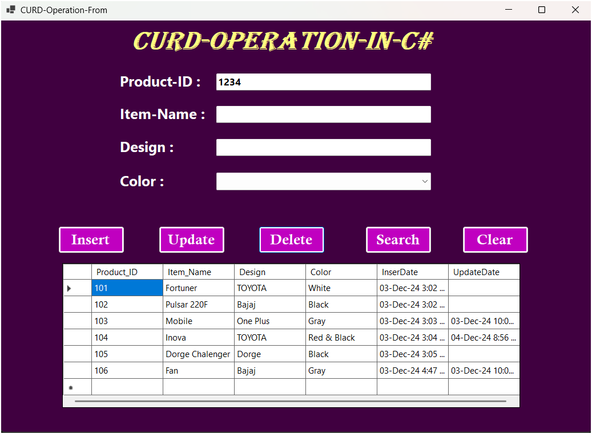

# CURD-Opration-C-Sharp
## The screenshot shows the application's interface with various CRUD functionalities implemented.

### This project is a GUI-based CRUD operation application built to manage and showcase Create, Read, Update, Delete and Search functionalities.
#### Features
##### Create: Add new records easily.
##### Read: View and search records in a user-friendly interface.
##### Update: Edit existing records with a few clicks.
##### Delete: Remove records safely and efficiently.
##### Search: Show Particular records.

